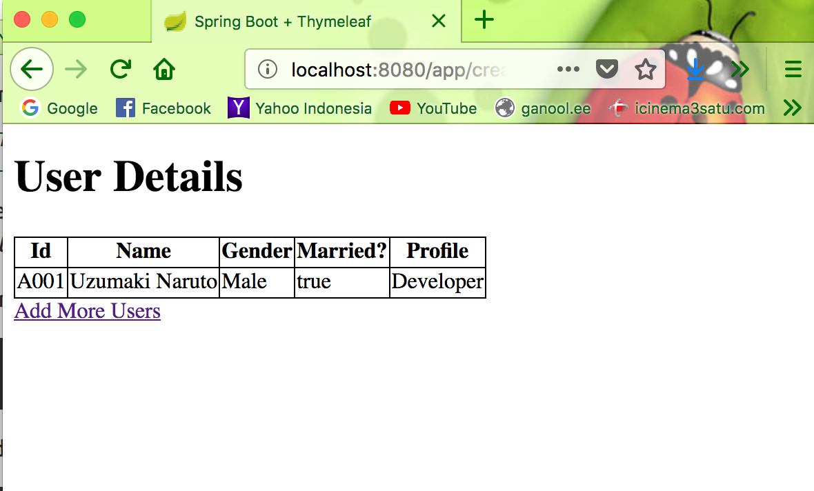

# Spring Boot Demo

### A Simple Spring Boot Demo

How to run this repo :

`mvn clean spring-boot:run`

Go to your browser :

`http://localhost:8080`

### Build Spring Boot Image

`mvn clean package`

### Build a Docker Image

Build the Docker image using following commands including the dot.

`docker build -f Dockerfile -t spring-boot-thymeleaf .`

### Run Docker Image

Run the Spring Boot application using this command, mapping your machine’s port 8080 to the container’s published port 8080 using -p

`docker run -p <machine_port>:<container_port> <Docker_Image_Name>``

`docker run -p 8080:8080 spring-boot-thymeleaf`

Home Page

Add User Validation Page

List User Page

